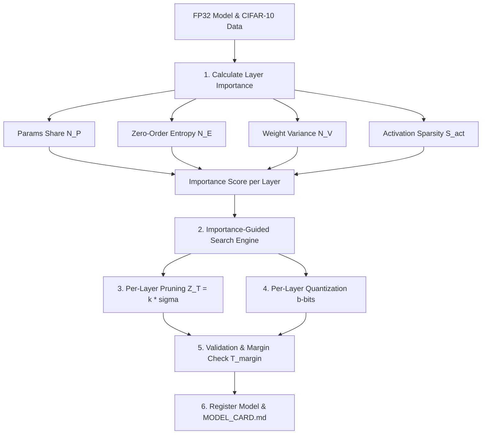

# Adaptive Quantization and Pruning of Deep Neural Networks via Layer Importance Estimation

[](https://pytorch.org/)
[](LICENSE)
[](https://neurips.cc/)

> **Capstone Project #1 (DS5619 - Machine Learning Systems Operations)**  
> Official implementation based on the NeurIPS 2024 Workshop paper:  
> **Tushar Shinde (2024).** *"Adaptive Quantization and Pruning of Deep Neural Networks via Layer Importance Estimation."* Workshop on Machine Learning and Compression, NeurIPS 2024.

---

## 💡 1. What is This Project? (In Simple Words)

Imagine you have a **giant 1,000-page encyclopedia** (a full 32-bit floating-point Convolutional Neural Network like VGG19 or ResNet) that can recognize 10 different objects (cats, dogs, airplanes, cars, etc.). 

Because it's so large:
- It **cannot fit on edge devices** like smartwatches, IoT sensors, or smartphones.
- It consumes too much memory (RAM) and drains battery quickly during AI inference.

### The Solution: Adaptive Compression (AQP)
Standard compression techniques compress every single page (layer) uniformly (e.g., forcing all layers to 8-bit precision or cutting 50% of weights everywhere). However:
- **Early layers** only look for simple lines or colors, so they can be compressed aggressively to **1-bit or 2-bit precision** without hurting accuracy.
- **Deeper layers** distinguish complex features (like cat ears vs. dog noses), so they need higher precision (e.g., **4-bit or 6-bit**) to avoid confusing objects.

**Our system acts as a smart editor:** It calculates a **Statistical Layer Importance Score** for every layer and adaptively shrinks each layer differently, keeping the model **smart** while making its file size **ultra-small**.

---

## 🛠️ 2. What We Implemented & How It Works

We built a modular, production-ready **MLOps Compression Pipeline** in PyTorch that includes:



### Mathematical Formulation

1. **Statistical Importance Score:**
   For every layer \(l\), we extract 4 statistical signals:
   - **Parameter Share \(N_P(l)\):** Ratio of parameters in layer \(l\) vs total model parameters.
   - **Zero-Order Entropy \(N_E(l)\):** Information content \(H_0(W_l) = -\sum p_i \log_2 p_i\) normalized by bit width.
   - **Weight Variance \(N_V(l)\):** Measures parameter distribution compactness \(\log(e - 1 + \text{Var}(W_l)/\max \text{Var})\).
   - **Activation Sparsity \(S_{act}(l)\):** Measured via PyTorch forward hooks over calibration batches.

   \[
   Importance(l) = w_P \cdot N_P(l) + w_E \cdot N_E(l) + w_V \cdot N_V(l) + w_S \cdot S(l)
   \]

2. **Adaptive Standard Deviation Pruning:**
   Calculates a zero-threshold \(Z_T(l) = k(l) \times \sigma(W_l)\), setting weights to zero if \(|W_{l,ij}| \le Z_T(l)\).

3. **Per-Layer Quantization & Search Loop:**
   Ranks layers by importance and searches for the minimum bit-width \(b(l) \in [1, 8]\) and maximum pruning factor \(k(l) \in [0, 3]\) such that classification accuracy drop stays within \(T_{margin}\) (default \(0.1\%\)).

4. **Weighted Average Bit-Width Metric (\(\bar{b}\)):**
   \[
   \bar{b} = \sum_{l=1}^{L} b(l) \cdot (1 - S(l)) \cdot N_P(l)
   \]

5. **Model Registry & Model Cards:**
   Automatically serializes quantized weights `.pt`, saves config metadata `metadata.json`, and generates a markdown `MODEL_CARD.md` with layer precision tables.

---

## 📂 3. Project Directory Structure

```
ADAPTIVE_COMPRESSION/
├── configs/
│   ├── default_config.yaml         # Global pipeline configuration
│   ├── vgg19_cifar10.yaml          # VGG19 configuration
│   ├── resnet18_cifar10.yaml       # ResNet18 configuration
│   └── resnet34_cifar10.yaml       # ResNet34 configuration
├── src/
│   ├── models/                     # Model definitions (VGG19, ResNet18, ResNet34)
│   ├── statistical_scorer.py       # Importance scoring algorithm
│   ├── quantizer.py                # Post-training uniform symmetric quantizer (1-8 bit)
│   ├── pruner.py                   # Standard deviation threshold pruner Z_T = k * sigma
│   ├── search_engine.py            # Importance-guided layer search engine
│   ├── huffman.py                  # Huffman entropy coding simulator
│   ├── model_registry.py           # Model card generator & artifact registry
│   └── utils.py                    # Data loading & accuracy evaluation utilities
├── experiments/
│   ├── train_baselines.py          # Custom baseline model training script
│   ├── run_compression.py          # Primary compression pipeline entrypoint
│   └── generate_benchmark_report.py# Benchmark reproduction report generator
├── registry/                       # Versioned compressed model checkpoints & Model Cards
├── tests/                          # Automated PyTest suite
├── requirements.txt                # Dependency list
└── README.md                       # Comprehensive guide
```

---

## 🚀 4. Step-by-Step Command Guide

### Step 1: Environment Setup
First, install all required dependencies:
```bash
pip install -r requirements.txt
```

### Step 2: Run Automated Unit Tests
Verify that all core components (Scorer, Quantizer, Pruner, Search Engine) are functioning properly:
```bash
python -m pytest
```

---

### Step 3: Custom Training (Train Baseline Model From Scratch)
If you want to train a brand new model from scratch or fine-tune on CIFAR-10 before compressing:

```bash
# Train VGG19 baseline for 5 epochs
python experiments/train_baselines.py --model vgg19 --epochs 5 --lr 0.01

# Train ResNet18 baseline
python experiments/train_baselines.py --model resnet18 --epochs 5 --lr 0.01

# Train ResNet34 baseline
python experiments/train_baselines.py --model resnet34 --epochs 5 --lr 0.01
```

*The trained baseline checkpoint will be saved to `./checkpoints/<model_name>_cifar10_baseline.pt`.*

---

### Step 4: Run Adaptive Compression Pipeline
To run the compression search engine on any model architecture using its YAML configuration:

```bash
# Compress VGG19 on CIFAR-10
python experiments/run_compression.py --config configs/vgg19_cifar10.yaml

# Compress ResNet18 on CIFAR-10
python experiments/run_compression.py --config configs/resnet18_cifar10.yaml

# Compress ResNet34 on CIFAR-10
python experiments/run_compression.py --config configs/resnet34_cifar10.yaml
```

**Using Your Custom Trained Weights:**
```bash
python experiments/run_compression.py --config configs/vgg19_cifar10.yaml --weights_path ./checkpoints/vgg19_cifar10_baseline.pt
```

**Fast Execution Test Mode (`--fast`):**
If you want to test the full pipeline in a few seconds without waiting for a dataset download:
```bash
python experiments/run_compression.py --config configs/vgg19_cifar10.yaml --fast
```

---

### Step 5: Generate Full Benchmark Comparison Report
To reproduce the paper's comparison between FP32 baseline, fixed 8-bit to 1-bit quantization, fixed pruning, and our Adaptive AQP:

```bash
python experiments/generate_benchmark_report.py
```

*This generates a markdown benchmark report at `./reports/BENCHMARK_REPORT.md`.*

---

## 📊 5. NeurIPS 2024 Paper Target Results

| Model | Baseline FP32 Acc | Proposed AQP Acc | Avg Bit-Width (\(\bar{b}\)) | Huffman Avg Bit-Width |
| :--- | :---: | :---: | :---: | :---: |
| **VGG19** | 91.16% | 91.16% | **1.08 bits** | **0.59 bits** |
| **ResNet18** | 86.06% | 86.06% | **2.66 bits** | **1.39 bits** |
| **ResNet34** | 86.22% | 86.13% | **2.42 bits** | **1.49 bits** |

---

## 🔮 6. What We Can Do Now & Future Extensions

Now that the core compression engine, registry, and configuration pipeline are complete, here are exciting next steps you can explore:

1. **Deploy to Custom Datasets:**
   - Extend `src/utils.py` to support datasets like **CIFAR-100**, **ImageNet-1K**, or **custom industrial image classification datasets**.
2. **Support New Architectures:**
   - Add model definitions for **MobileNetV2**, **EfficientNet**, or **Vision Transformers (ViT)** in `src/models/`.
3. **Hardware Runtime Export:**
   - Export compressed model variants to **ONNX**, **TensorRT**, or **TFLite INT8/INT4** runtimes for real-world deployment on edge microcontrollers and mobile devices.
4. **Quantization-Aware Training (QAT):**
   - Incorporate fine-tuning steps during the search loop to recover accuracy for ultra-low bit-widths.

---
*DS5619 Machine Learning Systems Operations Capstone Project 1.*
